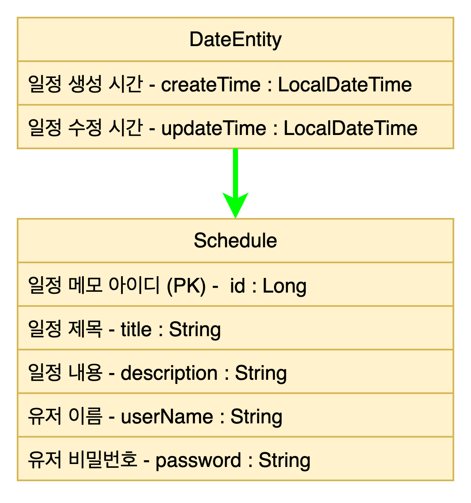

    일정관리 앱

API 명세서

- API 이름: ScheduleManagement
- URL: http://localhost:8080/schedule
- 응답 형식: 주로 JSON 형식으로 설명.
- 오류 메시지 형식: “선택한 메모의 아이디와 비번을 정확하게 입력해주세요.”

ERD

설명 
- 

//1. 3 Layer Architecture(Controller, Service, Repository)를 적절히 적용했는지 확인해 보고, 왜 이러한 구조가 필요한지 작성해 주세요.
//2. `@RequestParam`, `@PathVariable`, `@RequestBody` 이 각각 어떤 어노테이션인지, 어떤 특징을 갖고 있는지 작성해 주세요.