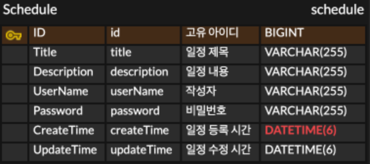

    일정관리 앱

프로젝트 개요
- 프로젝트 목적: 3 Layer Architecture(Controller, Service, Repository)를 적용하여 만드는 일정 관리 앱을 만들기
- 주요 학습 목표: 3 Layer Architecture(Controller, Service, Repository)의 개념 이해와 상황에 맞는 어노테이션(@..)을 잘 활용하기

기술 스택
- Language: Java 17
- IDE: IntelliJ IDEA
- POSTMAN, MySQL

API 명세서

- API 이름: ScheduleManagement
- URL: http://localhost:8080/schedule
- 응답 형식: 주로 JSON 형식으로 설명.
- 오류 메시지 형식: “선택한 메모의 아이디와 비번을 정확하게 입력해주세요.”

ERD

주요 기능
- 일정 생성
- 일정 전체 조회 (or 작성자를 기준으로 조회)
- 일정 단건 조회 (고유 식별자 Id로 조회)
- 일정 수정 (고유 식별자 Id로 찾은 후 비밀번호 매칭 후 일정 제목과 작서자명만 수정)
- 일정 삭제 (고유 식별자 Id로 찾은 후 비밀번호 매칭 후 삭제)

패키지 구조

실행 방법
- ScheduleManagementApplication 실행 후 포스트맨을 연동하여 각 기능의 맞는 입력 값을 입력 후 저장 및 출력 확인

트러블 슈팅
- 블로그 주소 (https://byeongsu.tistory.com/40)

1. 3 Layer Architecture(Controller, Service, Repository)를 적절히 적용했는지 확인해 보고, 왜 이러한 구조가 필요한지 작성해 주세요.
> 각 계층의 역할을 나눔으로써 유지 보수를 용이하게 하고 코드 재사용성을 높입니다. 
2. `@RequestParam`, `@PathVariable`, `@RequestBody` 이 각각 어떤 어노테이션인지, 어떤 특징을 갖고 있는지 작성해 주세요.
> @RequestPatam,@PathVarialbe 둘 다 데이터를 받아오는데 사용하지만 PathVariable은 값을 하나만 받아올 수 있고, RequestParam은 여러개의 값을 받아올 수 있어 페이징 작업(필터링)을 하기에 용이하다.
> @RequestBody는 http의 요청(Json)의 body 내용을 java 객체로 매핑하는 역할을 한다.